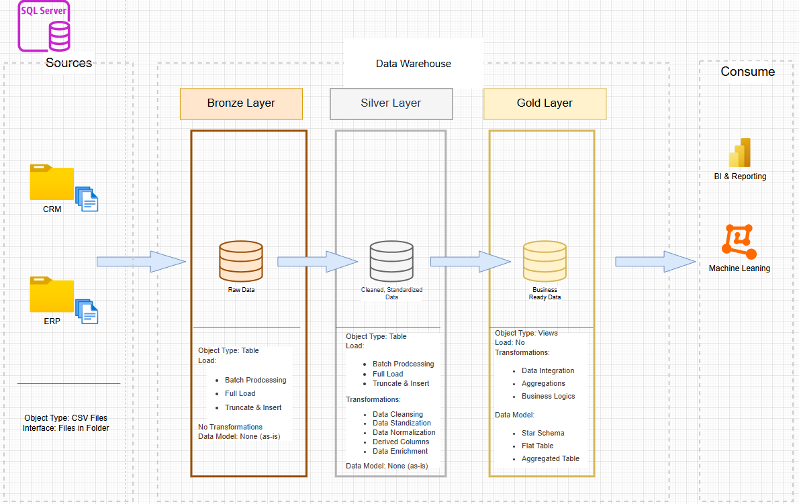

# SQL-Data-Warehouse-Project
Building a modern data warehouse with SQL Server, including ETL processes, Data Modeling and Analytics.
# 🚀 Data Warehouse & Analytics Project

<p align="center">


</p>

<p align="center">
  
</p>

---

## 📖 Overview

This project demonstrates the complete lifecycle of a modern data warehouse solution, from ingesting raw data to generating business insights.

The solution consolidates data from multiple business systems, applies data quality processes, transforms and models data, and produces analytics-ready datasets for reporting and decision-making.

---

# 🏗️ Project Architecture

# 📂 Project Structure

<p align="center">
   
</p>

# 🎯 Project Requirements

## 📦 Building the Data Warehouse (Data Engineering)

### Objective

Develop a modern data warehouse using SQL Server to consolidate sales data and support analytical reporting and informed business decision-making.

### Specifications

✔ Import data from ERP and CRM systems

✔ Process source data from CSV files

✔ Clean and resolve data quality issues

✔ Integrate multiple sources into a unified data model

✔ Create analytics-ready datasets

✔ Document the complete solution

---

## 📊 Analytics & Reporting (Data Analytics)

### Objective

Develop SQL-based analytics that provide actionable insights into:

- 👥 Customer Behavior
- 📦 Product Performance
- 📈 Sales Trends
- 💰 Revenue Analysis
- 🌎 Geographic Performance

These insights help stakeholders make data-driven decisions.

---

# ⚙️ Technology Stack

| Category | Technology |
|-----------|------------|
| Database | SQL Server |
| ETL | T-SQL |
| Data Modeling | Star Schema |
| Analytics | SQL |
| Reporting | Power BI |
| Version Control | Git & GitHub |

---

# 🗄️ Data Warehouse Design

## Layers

### 🥉 Bronze Layer

Raw source data imported from ERP and CRM systems.

### 🥈 Silver Layer

Data cleansing, standardization, transformation, and validation.

### 🥇 Gold Layer

Business-ready analytical model optimized for reporting.

---

# 📂 Project Structure

```text
Data-Warehouse-Project
│
├── datasets/
│
├── scripts/
│   ├── bronze/
│   ├── silver/
│   └── gold/
│
├── analytics/
│
├── powerbi/
│
├── docs/
│
└── README.md
```

---

# 📈 Analytics Delivered

### Customer Analysis

- Customer segmentation
- Purchase behavior
- Customer value analysis

### Product Analysis

- Top-performing products
- Revenue contribution
- Product trends

### Sales Analysis

- Monthly sales trends
- Revenue growth
- Sales performance tracking

---

# 📸 Dashboard Preview

## Executive Dashboard


---

## Sales Analysis


---

## Customer Insights


---

# 🔍 Data Quality Checks

- Missing value detection
- Duplicate removal
- Standardization
- Validation rules
- Data consistency checks

---

# 📊 Sample KPIs

| KPI | Description |
|------|------------|
| Revenue | Total Sales Revenue |
| Orders | Number of Orders |
| Customers | Unique Customers |
| AOV | Average Order Value |
| Growth % | Revenue Growth |

---

# 🚀 Key Features

✅ End-to-End Data Warehouse

✅ ETL Pipeline Development

✅ Data Cleansing

✅ Dimensional Modeling

✅ SQL Analytics

✅ Power BI Reporting

✅ Business Intelligence Dashboards

---

# 📚 Learning Outcomes

This project demonstrates practical experience with:

- Data Warehousing
- ETL Development
- SQL Server
- Data Modeling
- Business Intelligence
- Power BI
- Analytics Engineering

---

# 👨‍💻 Author

**Deepak**

Business Administration Accounting Graduate

Aspiring Data Analyst | Future CPA

---

## ⭐ If you found this project useful, consider starring the repository.
